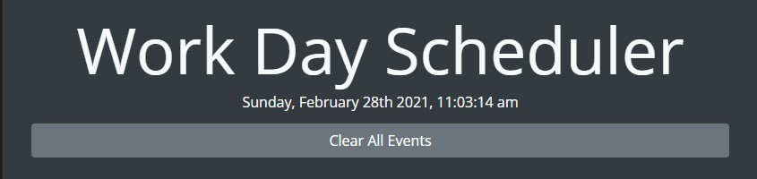
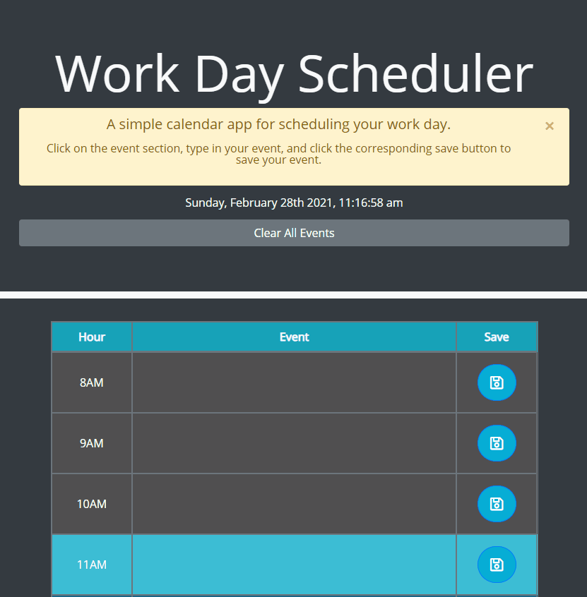
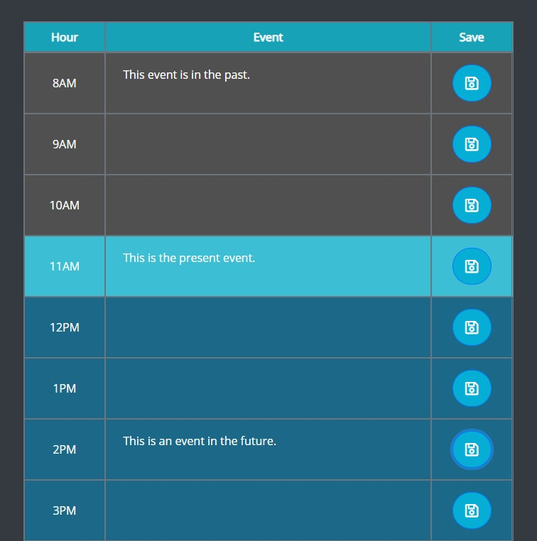
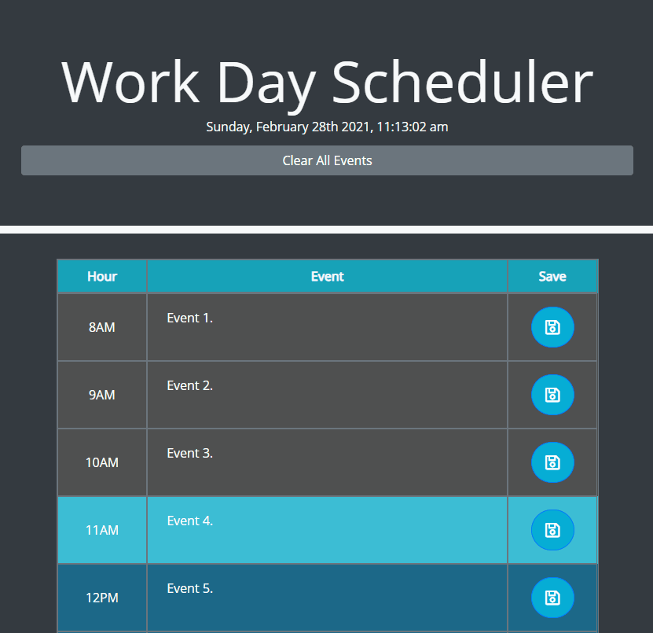

# Work Day Scheduler

</img>

This is a minimalist work day scheduler web application that is built with mobile-first and responsive design.

## Features

* Live clock display in the header.
* Time block colors change on page load, based on the current time.
* Persistent event saving using `window.localStorage`.
* Dismissable alert for instructions and use of the application.

## Usage

Click on a timeblock to edit its contents. You can then click the save button beside that timeblock to save that event and it will persist upon reloading the page. If you wish to clear all events quickly, click the "Clear All Events" button in the header, and it will ask for your confirmation to clear all events.

A deployed version is available <a href="#">here</a>.

## Gallery

### Dismissible instructions and Event Saving
</img>

### Past, Present and Future Timeblock Highlighting
</img>

### Clear all events with a single button!
</img>

## Credits

### APIs Used
* <a href="https://jquery.com/">jQuery</a> for DOM manipulation.
* <a href="https://momentjs.com/">Moment.js</a> for time related functionality.
* <a href="https://getbootstrap.com/">Bootstrap</a> for CSS style templates.
* <a href="https://fontawesome.com/">Font Awesome</a> and <a href="https://fonts.google.com/">Google Fonts</a> for font related styling.